# Jarkom-Modul-2-E17-2023
Kelompok E17 -
Jaringan Komputer (F) </br>
*Insitut Teknologi Sepuluh Nopember*

**Authors :**
| Name                  | Student ID |
| ----------------------|------------|
| Rizky Alifiyah Rahma  | 5025211208 |
| Dilla Wahdana         | 5025211234 |

## Soal 1
> Yudhistira akan digunakan sebagai DNS Master, Werkudara sebagai DNS Slave, Arjuna merupakan Load Balancer yang terdiri dari beberapa Web Server yaitu Prabakusuma, Abimanyu, dan Wisanggeni. Buatlah topologi dengan pembagian sebagai berikut. Folder topologi dapat diakses pada drive berikut 

### Script Pengerjaan
- Topologi yang kami buat seperti gambar dibawah ini
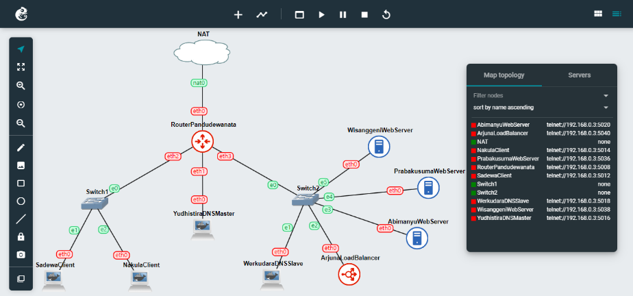
- Lalu kita setting network masing-masing node dengan fitur ``Edit network configuration``

Pandudewanata (Router)
```
auto eth0
iface eth0 inet dhcp

auto eth1
iface eth1 inet static
	address 10.45.1.1
	netmask 255.255.255.0

auto eth2
iface eth2 inet static
	address 10.45.2.1
	netmask 255.255.255.0

auto eth3
iface eth3 inet static
	address 10.45.3.1
	netmask 255.255.255.0
```
Yudhistira (DNS Master)
```
auto eth0
iface eth0 inet static
	address 10.45.1.2
	netmask 255.255.255.0
	gateway 10.45.1.1
```
Sadewa (Client)
```
auto eth0
iface eth0 inet static
	address 10.45.2.2
	netmask 255.255.255.0
	gateway 10.45.2.1
```
Nakula (Client)
```
auto eth0
iface eth0 inet static
	address 10.45.2.3
	netmask 255.255.255.0
	gateway 10.45.2.1
```
Werkudara (DNS Slave)
```
auto eth0
iface eth0 inet static
	address 10.45.3.2
	netmask 255.255.255.0
	gateway 10.45.3.1
```
Abimanyu (Web Server)
```
auto eth0
iface eth0 inet static
	address 10.45.3.3
	netmask 255.255.255.0
	gateway 10.45.3.1
```
Prabukusuma (Web Server)
```
auto eth0
iface eth0 inet static
	address 10.45.3.4
	netmask 255.255.255.0
	gateway 10.45.3.1
```
Wisanggeni (Web Server)
```
auto eth0
iface eth0 inet static
	address 10.45.3.5
	netmask 255.255.255.0
	gateway 10.45.3.1
```
- Kemudian jalankan semua node yang ada
- Topologi yang dibuat sudah bisa berjalan secara lokal, tetapi kita belum bisa mengakses jaringan keluar. Maka kita perlu melakukan beberapa hal.
Ketikkan ``iptables -t nat -A POSTROUTING -o eth0 -j MASQUERADE -s 10.45.0.0/16`` pada router
- Lalu ketikkan command ini di node ubuntu yang lain ``echo nameserver 192.168.122.1 > /etc/resolv.conf``
- Semua node sekarang seharusnya sudah bisa melakukan ``ping`` ke google, yang artinya adalah sudah tersambung ke internet
### Hasil
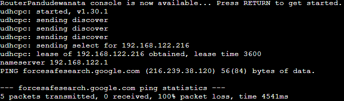
## Soal 2
> Buatlah website utama pada node arjuna dengan akses ke arjuna.yyy.com dengan alias www.arjuna.yyy.com dengan yyy merupakan kode kelompok.

## Script Pengerjaan
- Dilakukan setup terlebih dahulu pada Node Yudhistira (DNS Master) anatara lain mengkoneksikan ke routernya menggunakan ``echo nameserver 192.168.122.1 > /etc/resolv.conf`` lalu Instalasi bind ``apt-get update`` dan ``apt-get install bind9 -y``
- Kemudian buat domain dengan nama ``arjuna.E17.com`` berikut sciptnya:
lakukan perintah dibawah dan isi konfigurasi domain ``arjuna.E17.com``
```
nano /etc/bind/named.conf.local
zone "arjuna.E17.com" {
	type master;
	file "/etc/bind/jarkom/arjuna.E17.com";
};
```
Buat folder jarkom di dalam ``/etc/bind`` dan copykan file ``db.local`` ke folder ``jarkom`` yang baru saja dibuat dan ubah namanya menjadi ``arjuna.E17.com``
```
mkdir /etc/bind/jarkom
cp /etc/bind/db.local /etc/bind/jarkom/jarkom2022.com
```
Kemudian buka file ``arjuna.E17.com`` dan edit syntaxnya dengan IP Yudhistira masing-masing kelompok:
```
nano /etc/bind/jarkom/jarkom2022.com
;
; BIND data file for local loopback interface
;
$TTL	604800
@	IN	SOA	arjuna.E17.com. root.arjuna.E17.com. (
			2		; Serial
			604800	; Refresh
			86400		; Retry
			2419200	; Expire
			604800 )	; Negative Cache TTL
;
@	IN	NS	arjuna.E17.com.
@	IN	A	10.45.3.3
```
- Restart bind dengan perintah ``service bind9 restart``, lalu pada client conectkan dengan DNS nya menggunakan perintah ``echo nameserver 10.45.1.2 > /etc/resolv.conf`` dan ping domain arjuna.E17.com dengan ``ping arjuna.E17.com -c 5``
### Hasil
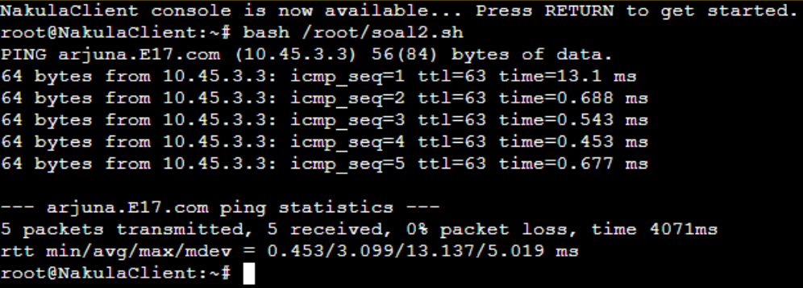

## Soal 3
> Dengan cara yang sama seperti soal nomor 2, buatlah website utama dengan akses ke abimanyu.yyy.com dan alias www.abimanyu.yyy.com.

### Script Pengerjaan
- mirip seperti nomor 2, yang beda hanya pada penamaan domain dan IP yang ada pada file domain
```
nano /etc/bind/named.conf.local
zone "abimanyu.E17.com" {
	type master;
	file "/etc/bind/jarkom/abimanyu.E17.com";
};
mkdir /etc/bind/jarkom
cp /etc/bind/db.local /etc/bind/jarkom/abimanyu.E17.com

nano /etc/bind/jarkom/jarkom2022.com
;
; BIND data file for local loopback interface
;
$TTL	604800
@	IN	SOA	abimanyu.E17.com. root.abimanyu.E17.com. (
			2		; Serial
			604800		; Refresh
			86400		; Retry
			2419200		; Expire
			604800 )	; Negative Cache TTL
;
@	IN	NS	abimanyu.E17.com.
@	IN	A	10.45.3.4   ; IP abimanyu
```
- Restart bind dengan perintah ``service bind9 restart``, lalu pada client conectkan dengan DNS nya menggunakan perintah ``echo nameserver 10.45.1.2 > /etc/resolv.conf`` dan ping domain abimanyu.E17.com dengan ``ping abimanyu.E17.com -c 5``
### Hasil
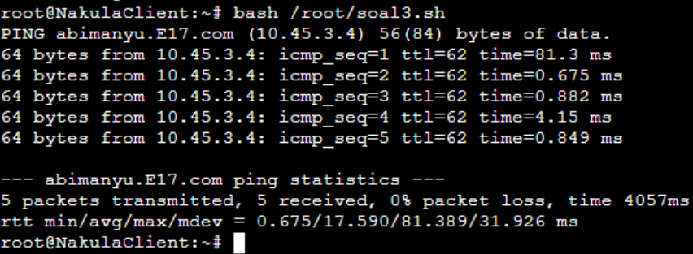

## Soal 4
> Kemudian, karena terdapat beberapa web yang harus di-deploy, buatlah subdomain parikesit.abimanyu.yyy.com yang diatur DNS-nya di Yudhistira dan mengarah ke Abimanyu.

### Script Pengerjaan
- Pada Yudhistira, edit file ``/etc/bind/jarkom/abimanyu.E17.com`` lalu tambahkan subdomain untuk abimanyu.E17.com yang mengarah ke IP Yudhistira. dan tambahkan konfigurasi seperti berikut
```
nano /etc/bind/jarkom/abimanyu.E17.com
;
; BIND data file for local loopback interface
;
$TTL	604800
@	IN	SOA	abimanyu.E17.com. root.abimanyu.E17.com. (
			2		    ; Serial
			604800		; Refresh
			86400		; Retry
			2419200		; Expire
			604800 )	; Negative Cache TTL
;
@	IN	NS	abimanyu.E17.com.
@	IN	A	10.45.1.2   ; IP Yudhistira
www	IN	CNAME	abimanyu.E17.com.
parikesit IN	A	10.45.1.2    ; alias
```
- Restart bind dengan perintah ``service bind9 restart``
- Lalu pada client ping subdomain parikesit.abimanyu.E17.com dengan ``ping parikesit.abimanyu.E17.com -c 5``
### Hasil
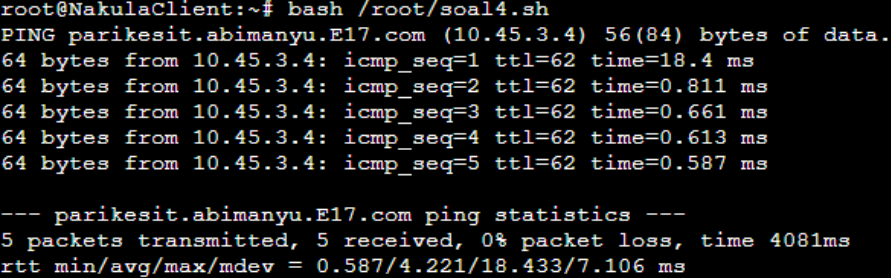

## Soal 5
> Buat juga reverse domain untuk domain utama. (Abimanyu saja yang direverse)

### Script Pengerjaan
- Pada Yudhistira, edit file ``/etc/bind/named.conf.local``. Lalu tambahkan konfigurasi berikut ke dalam file ``named.conf.local``. Tambahkan reverse dari 3 byte awal dari IP yang ingin dilakukan Reverse DNS.
```
nano /etc/bind/named.conf.local
zone "3.45.10.in-addr.arpa" {
	type master;
	file "/etc/bind/jarkom/3.45.10.in-addr.arpa";
};
```
- Buat folder jarkom dengan perintah ``mkdir /etc/bind/jarkom`` lalu copykan file ``db.local`` ke dalam folder jarkom yang baru saja dibuat dan ubah namanya menjadi 2.168.192.in-addr.arpa ``cp /etc/bind/db.local /etc/bind/jarkom/3.45.10.in-addr.arpa``
- buka file ``abimanyu.E17.com`` lalu edit konfigurasinya
```
;
; BIND data file for local loopback interface
;
$TTL	604800
@	IN	SOA	abimanyu.E17.com. root.abimanyu.E17.com. (
			2		    ; Serial
			604800	    ; Refresh
			86400		; Retry
			2419200	    ; Expire
			604800 )	; Negative Cache TTL
;
3.45.10.in-addr.arpa.	IN	NS	abimanyu.E17.com.
4			IN	PTR	abimanyu.E17.com.    ; byte ke-4 dari IP abimanyu
```
- Restart bind dengan perintah ``service bind9 restart``
- Lalu pada client update package list dan install ``dnsutils``, kemudian kembalikan nameserver agar tersambung dengan yudhistira
```
apt-get update
apt-get install dnsutils

host -t PTR 10.45.3.4
``` 
### Hasil
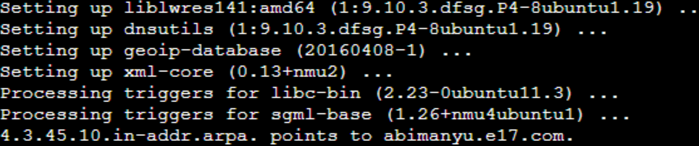

## Soal 6
> Agar dapat tetap dihubungi ketika DNS Server Yudhistira bermasalah, buat juga Werkudara sebagai DNS Slave untuk domain utama.

### Script Pengerjaan
- Pada yudhistira edit file ``/etc/bind/named.conf.local`` dan sesuaikan dengan syntax berikut
```
zone "abimanyu.E17.com" {
    type master;
    notify yes;
    also-notify { 10.45.3.2; }; // Masukan IP Water7 tanpa tanda petik
    allow-transfer { 10.45.3.2; }; // Masukan IP Water7 tanpa tanda petik
    file "/etc/bind/jarkom/abimanyu.E17.com";
};
```
- Restart bind dengan perintah ``service bind9 restart``
- Buka werkudara, update package lists dan install aplikasi ``bind9``
```
apt-get update
apt-get install bind9 -y
```
- Kemudian buka file ``/etc/bind/named.conf.local`` dan tambahkan syntax berikut
```
zone "abimanyu.E17.com" {
    type slave;
    masters { 10.45.1.2; }; // Masukan IP YudhistiraDNS tanpa tanda petik
    file "/var/lib/bind/abimanyu.E17.com";
};
```
- Restart bind dengan perintah ``service bind9 restart``
- Pada server Yudhistira matikan service bind9 ``service bind9 stop``
- Pada client Nakula pastikan pengaturan nameserver mengarah ke IP Yudhistira dan IP Werkudara, lalu lakukan ``ping`` ke abimanyu
```
echo nameserver 10.45.1.2 > /etc/resolv.conf
echo nameserver 10.45.3.2 > /etc/resolv.conf

ping abimanyu.E17.com -c 5
```
### Hasil
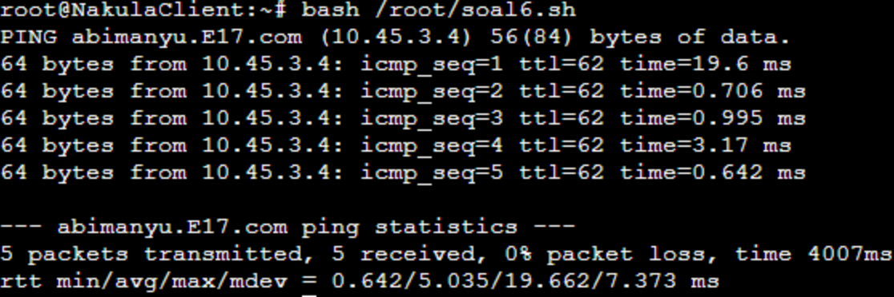

## Soal 7
> Seperti yang kita tahu karena banyak sekali informasi yang harus diterima, buatlah subdomain khusus untuk perang yaitu baratayuda.abimanyu.yyy.com dengan alias www.baratayuda.abimanyu.yyy.com yang didelegasikan dari Yudhistira ke Werkudara dengan IP menuju ke Abimanyu dalam folder Baratayuda.

### Script Pengerjaan
- Pada Yudhistira, edit file ``/etc/bind/jarkom/abimanyu.E17.com`` dan ubah sesuai IP server masing-masing. Perlu menambahkan ``ns1     IN      A       10.55.1.5     ; IP Werkudara`` agar mendapatkan authoritative terhadap Werkudara. ``baratayuda IN NS ns1`` Ini menetapkan server DNS yang berwenang (ns1) untuk subdomain "baratayuda".
```
nano /etc/bind/jarkom/abimanyu.E17.com
;
; BIND data file for local loopback interface
;
$TTL	604800
@	IN	SOA	abimanyu.E17.com. root.abimanyu.E17.com. (
			2		; Serial
			604800		; Refresh
			86400		; Retry
			2419200		; Expire
			604800 )	; Negative Cache TTL
;
@	IN	NS	abimanyu.E17.com.
@	IN	A	10.45.3.4	; IP abimanyu
www	IN	CNAME	abimanyu.E17.com.
parikesit IN	A	10.45.3.4	; IP abimanyu 
ns1	IN	A	10.45.3.2	; IP werkudara
baratayuda IN	NS	ns1
@	IN	AAAA	::1
```
- Buat file ``/etc/bind/named.conf.options`` yang digunakan untuk mengatur opsi konfigurasi global untuk server ``DNS BIND`` dan edit konfigurasinya seperti berikut
```
nano /etc/bind/named.conf.options
options {
	directory "var/cache/bind";

	// forwarders {
	//	0.0.0.0;
	// };

	//dnssec-validation auto;
	allow-query {any;};

	auth-nxdomain no;
	listen-on-v6 { any; };
};

```
- Kemudian edit file ``named.conf.local`` sesuai syntax berikut, disini kita menambahkan ``allow-transfer`` untuk mengizinkan melakukan transfer zona dari server
```
nano /etc/bind/named.conf.local
zone "abimanyu.E17.com" {
	type master;
	file "/etc/bind/jarkom/abimanyu.E17.com";
	allow-transfer {10.45.3.2;};	// IP werkudara
};

zone "3.45.10.in-addr.arpa" {
	type master;
	file "/etc/bind/jarkom/3.45.10.in-addr.arpa";
};

```
- Restart bind dengan perintah ``service bind9 restart``
- Selanjutnya pada werkudara kita tambahkan file ``named.conf.options`` dan juga file dari ``/etc/bind/named.conf.local``
```
nano /etc/bind/named.conf.options
options {
	directory "var/cache/bind";

	// forwarders {
	//	0.0.0.0;
	// };

	//dnssec-validation auto;
	allow-query {any;};

	auth-nxdomain no;
	listen-on-v6 { any; };
};

nano /etc/bind/named.conf.local
zone "baratayuda.abimanyu.E17.com" {
    type master;
    file "/etc/bind/delegasi/baratayuda.abimanyu.E17.com";
};
```
- Buat folder delegasi dengan perintah ``mkdir /etc/bind/delegasi`` lalu copykan file ``db.local`` ke dalam folder delegasi yang baru saja dibuat
- Edit file ``baratayuda.abimanyu.E17.com`` sesuai sytax berikut, dengan menambahkan nama server otoritatif untuk zona ini dan tambah nama alias dengan ``www`` yang dihubungkan ke abimanyu.
```
;
; BIND data file for local loopback interface
;
$TTL	604800
@	IN	SOA	baratayuda.abimanyu.E17.com. root.baratayuda.abimanyu.E17.com (
			2		    ; Serial
			604800		; Refresh
			86400		; Retry
			2419200		; Expire
			604800 )	; Negative Cache TTL
;
@	IN	NS	baratayuda.abimanyu.E17.com.
@	IN	A	10.45.3.4	; abimanyu
www	IN	A	10.45.3.4	; abimanyu
```
- Restart bind dengan perintah ``service bind9 restart``
- Lalu pada client lakukan ping ``baratayuda.abimanyu.E17.com`` dan ``www.baratayuda.abimanyu.E17.com``
### Hasil
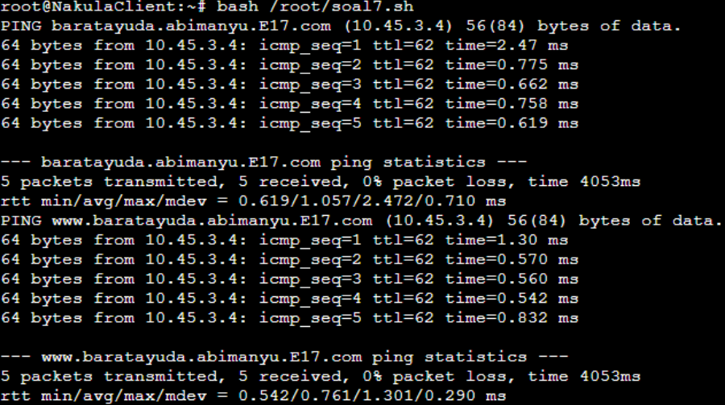

## Soal 8
> Untuk informasi yang lebih spesifik mengenai Ranjapan Baratayuda, buatlah subdomain melalui Werkudara dengan akses rjp.baratayuda.abimanyu.yyy.com dengan alias www.rjp.baratayuda.abimanyu.yyy.com yang mengarah ke Abimanyu.

### Script Pengerjaan
- Dikarenakan sebelumnya telah melakukan delegasi terhadap DNS Slave, sekarang diberi perintah untuk melakukan subdomain terhadap delegasi domain tadi. Langkah pertama edit file ``baratayuda.abimanyu.E17.com`` pada DNS slave werkudara untuk melakukan penambahan subdomain dan aliasnya dengan menghubungkan ke abimanyu dengan memasukkan IP nya
```
nano /etc/bind/delegasi/baratayuda.abimanyu.E17.com
;
; BIND data file for local loopback interface
;
$TTL	604800
@	IN	SOA	baratayuda.abimanyu.E17.com. root.baratayuda.abimanyu.E17.com (
			2		; Serial
			604800		; Refresh
			86400		; Retry
			2419200		; Expire
			604800 )	; Negative Cache TTL
;
@	IN	NS	baratayuda.abimanyu.E17.com.
@	IN	A	10.45.3.4	; abimanyu
www	IN	A	10.45.3.4	; abimanyu
rjp	IN	A	10.45.3.4	; abimanyu
www.rjp IN	A	10.45.3.4	; abimanyu
```
- Restart bind dengan perintah ``service bind9 restart``
- Lalu pada client ping subdoaminnya ``rjp.baratayuda.abimanyu.E17.com`` dan ``www.rjp.baratayuda.abimanyu.E17.com``
### Hasil
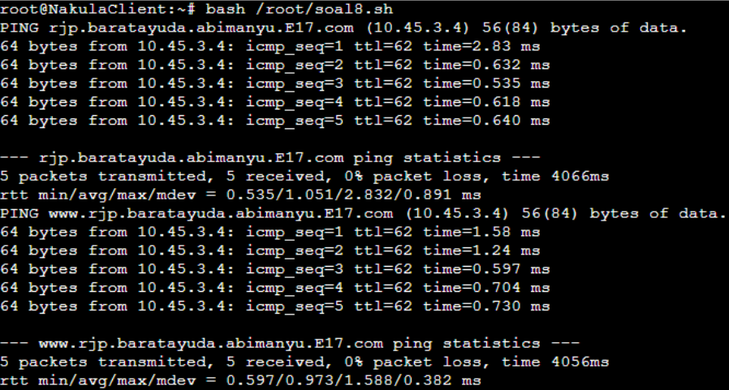

## Soal 9
> Arjuna merupakan suatu Load Balancer Nginx dengan tiga worker (yang juga menggunakan nginx sebagai webserver) yaitu Prabakusuma, Abimanyu, dan Wisanggeni. Lakukan deployment pada masing-masing worker.

### Script Pengerjaan
- Pada arjuna load balancer, kita konfigurasi DNS nya dan update package list beserta install Nginx
```
echo 'nameserver 192.168.122.1' > /etc/resolv.conf

apt-get update
apt-get install nginx
```
- kemudian buat file``/etc/resolv.conf`` dan isikan beberapa alamat DNSnya. Lalu buat juga file untuk membuat konfigurasi server Nginx yang mana konfigurasi ini mengatur Nginx untuk mendengarkan permintaan pada ``port 80`` dan meneruskannya ke grup server yang ditentukan di dalam blok ``upstream``.
```
nano /etc/resolv.conf
nameserver 10.45.1.2
nameserver 10.45.3.2
nameserver 10.45.3.3

nano /etc/nginx/sites-available/lb-modul2
upstream webserver {
	server 10.45.3.4;
	server 10.45.3.5;
	server 10.45.3.6;
}

server {
	listen 80;
	server_name arjuna.E17.com;

	location / {
	proxy_pass http://webserver;
	}
}
```
- Setelah itu buat symlink (shortcut) dari konfigurasi Nginx yang telah dibuat di dalam direktori ``sites-available`` ke direktori ``sites-enabled``. Ini diperlukan agar konfigurasi tersebut dapat diaktifkan. Baru restart bind dengan perintah ``service bind9 restart`` dan cek status server Nginx untuk memastikan bahwa server tersebut berjalan dengan baik.
```
ln -s /etc/nginx/sites-available/lb-modul2 /etc/nginx/sites-enabled

service nginx restart
service nginx status
```
- Selanjutnya pada masing-masing web servernya konfigurasikan DNS nya, update package list dan install paket ``Nginx``, ``php``, dan ``php-fm``, tampilkan versi PHP yang diinstall, dan buat direktori baru bernama ``modul2`` di dalam direktori ``/var/www``
```
echo nameserver 192.168.122.1 > /etc/resolv.conf
apt-get update && apt install nginx php php-fpm -y

php -v

echo nameserver 10.45.1.2 > /etc/resolv.conv

mkdir /var/www/modul2
```
- Buat file index.php di dalam direktori ``/var/www/modul2`` dengan konten PHP yang mencetak "Halo, ini web server [nama_webServer]". serta buat konfigurasi server Nginx dan menyimpannya dalam file ``/etc/nginx/sites-available/modul2``. Konfigurasi ini mengatur Nginx untuk mendengarkan permintaan pada ``port 80``, menetapkan root direktori ke ``/var/www/modul2``, mengizinkan akses file PHP, dan mencatat error dan akses log.
```
nano /var/www/modul2/index.php
<?php
echo "Halo, ini web server [nama_webServer]";
?>

nano /etc/nginx/sites-available/modul2
 server {

 	listen 80;

 	root /var/www/modul2;

 	index index.php index.html index.htm;
 	server_name _;

 	location / {
 			try_files $uri $uri/ /index.php?$query_string;
 	}

 	# pass PHP scripts to FastCGI server
 	location ~ \.php$ {
 	include snippets/fastcgi-php.conf;
 	fastcgi_pass unix:/var/run/php/php7.0-fpm.sock;
 	}

 location ~ /\.ht {
 			deny all;
 	}

 	error_log /var/log/nginx/jarkom_error.log;
 	access_log /var/log/nginx/jarkom_access.log;
 }
```
- Lalu buat symlink dari konfigurasi Nginx yang telah dibuat di dalam direktori ``sites-available``, hapus konfigurasi default Nginx yang ada di dalam direktori sites-enabled.
- Mulai layanan php-fpm, restart php-fpm, reload konfigurasi Nginx, menerapkan perubahan yang baru saja dibuat, restart server Nginx, dan terakir periksa sintaksis konfigurasi Nginx untuk memastikan tidak ada kesalahan sintaks.
```
ln -s /etc/nginx/sites-available/modul2 /etc/nginx/sites-enabled
rm -r /etc/nginx/sites-enabled/default

service php7.0-fpm start
service php7.0-fpm restart
service nginx reload
service nginx restart

nginx -t
```
- Baru jalankan perintah ``curl localhost`` untuk melakukan testing di tiap web server
### Hasil
- Pada Abimanyu web server
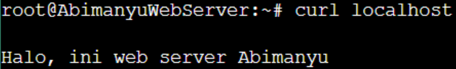

- Pada Prabukusuma web server
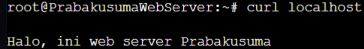

- Pada Wisanggeni web server
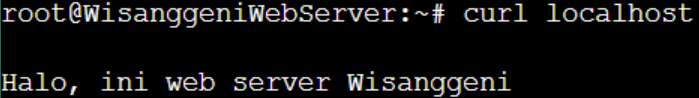

## Soal 10
> Kemudian gunakan algoritma Round Robin untuk Load Balancer pada Arjuna. Gunakan server_name pada soal nomor 1. Untuk melakukan pengecekan akses alamat web tersebut kemudian pastikan worker yang digunakan untuk menangani permintaan akan berganti ganti secara acak. Untuk webserver di masing-masing worker wajib berjalan di port 8001-8003. Contoh
    - Prabakusuma:8001
    - Abimanyu:8002
    - Wisanggeni:8003

### Script Pengerjaan
- Melanjutkan dari yang nomer 9 diatas, edit file ``lb-modul2`` pada arjuna load balancer dengan menambahkan port masing-masing web server
```
nano /etc/nginx/sites-available/lb-modul2
upstream webserver {
	server 10.45.3.4:8001;
	server 10.45.3.5:8002;
	server 10.45.3.6:8003;
}

server {
	listen 80;
	server_name arjuna.E17.com;

	location / {
	proxy_pass http://webserver;
	}
```
- Dan pada masing-masing web server edit file ``modul2`` dengan menambahkan port sesuai web server yang dituju.
```
nano /etc/nginx/sites-available/modul2 
 server {

 	listen [port_webServer];

 	root /var/www/modul2;

 	index index.php index.html index.htm;
 	server_name _;

 	location / {
 			try_files $uri $uri/ /index.php?$query_string;
 	}

 	# pass PHP scripts to FastCGI server
 	location ~ \.php$ {
 	include snippets/fastcgi-php.conf;
 	fastcgi_pass unix:/var/run/php/php7.0-fpm.sock;
 	}

 location ~ /\.ht {
 			deny all;
 	}

 	error_log /var/log/nginx/jarkom_error.log;
 	access_log /var/log/nginx/jarkom_access.log;
 }
```
- Baru jalankan perintah ``curl localhost:[port_webServer]`` untuk melakukan testing di tiap web server
### Hasil
- Pada Abimanyu web server
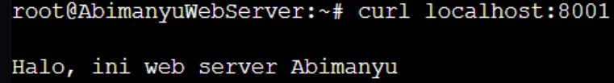

- Pada Prabukusuma web server
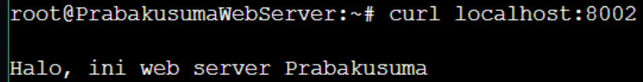

- Pada Wisanggeni web server
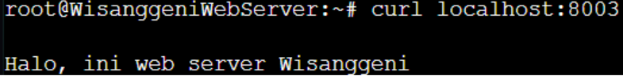

## Soal 11
> Selain menggunakan Nginx, lakukan konfigurasi Apache Web Server pada worker Abimanyu dengan web server www.abimanyu.yyy.com. Pertama dibutuhkan web server dengan DocumentRoot pada /var/www/abimanyu.yyy

### Script Pengerjaan
- lakukan instalaasi dan konfigurasi pada node Abimanyu
```
apt-get update
apt-get install apache2 -y
apt-get install libapache2-mod-php7.0 -y
service apache2 start
apt-get install wget -y
apt-get install unzip -y
apt-get install php -y
```
- Import file dari google drive yang disediakan untuk mengisi ``/var/www`` dari ``abimanyu.E17.com``
```
wget --no-check-certificate 'https://docs.google.com/uc?export=download&id=1a4V23hwK9S7hQEDEcv9FL14UkkrHc-Zc' -O abi
```
- Lakukan unzip dan sesuaikan struktur folder untuk tepat berada di dalam ``/var/www/abimanyu.E17``
```
unzip abi -d abimanyu.E17
rm abi
mv abimanyu.E17/abimanyu.yyy.com/* abimanyu.E17
rmdir abimanyu.E17/abimanyu.yyy.com
```
- Buat file abimanyu.E17.conf pada ``/etc/apache2/sites-available`` dan copy isi dari file ``000-default.conf`` ke dalamnya
```
cp 000-default.conf abimanyu.E17.conf
```
- Di dalam tag VirtualHost, isi dengan konfigurasi nama server, alias server, admin server dan pasang DocumentRoot pada /var/www/abimanyu.E17 yang tadi sudah diisi
- Kemudian setelah itu, untuk menampilkan pada client yaitu menggunakan lynx yang di-install (Jangan lupa untuk menambahkan nameserver router pada saat penginstalan). Baru jalankan testingnya
```
curl www.abimanyu.E17.com
curl abimanyu.E17.com
```
### Hasil
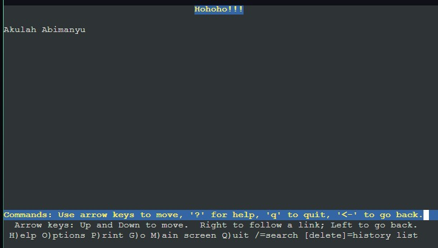
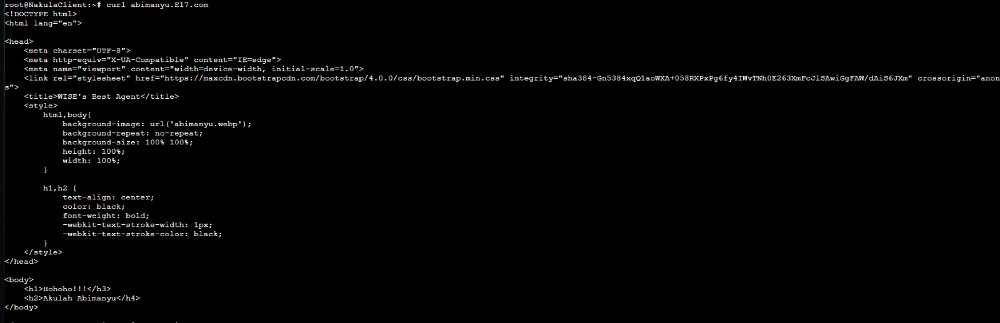

## Soal 12
> Setelah itu ubahlah agar url www.abimanyu.yyy.com/index.php/home menjadi www.abimanyu.yyy.com/home.

### Script Pengerjaan
- Buka file /etc/apache2/sites-available/abimanyu.E17.conf
- Untuk menyelesaikan permasalahan ini, diperlukan bantuan Directory sebagai tools untuk rewrite Indexes agar dapat melakukan Alias pada domain. Penerapan nya sebagai berikut
```
<Directory /var/www/abimanyu.E17/index.php/home>
  Options +Indexes
</Directory>

Alias "/home" "/var/www/abimanyu.E17/index.php/home"
```
- Setelah itu, lakukan testing dengan menjalankan command berikut pada Node Client
```
curl www.abimanyu.E17.com/home
curl abimanyu.E17.com/home
```
### Hasil

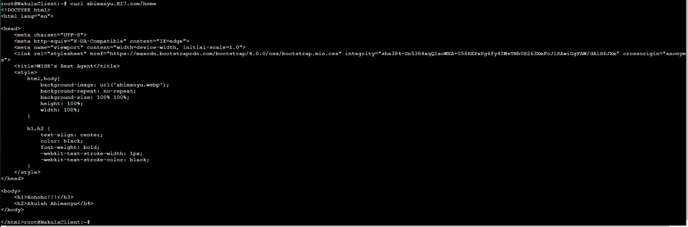

## Soal 13
> Selain itu, pada subdomain www.parikesit.abimanyu.yyy.com, DocumentRoot disimpan pada /var/www/parikesit.abimanyu.yyy

### Script Pengerjaan
- Import file dari google drive yang disediakan untuk mengisi /var/www dari parikesit.abimanyu.E17.com
```
wget --no-check-certificate 'https://docs.google.com/uc?export=download&id=1LdbYntiYVF_NVNgJis1GLCLPEGyIOreS' -O pari
```
- Lakukan unzip serta sesuaikan folder untuk tepat berada di dalam /var/www/parikesit.abimanyu.E17/abimanyu.E17
```
unzip pari -d parikesit.abimanyu.E17
rm pari
mv parikesit.abimanyu.E17/parikesit.abimanyu.yyy.com/* parikesit.abimanyu.E17
rmdir parikesit.abimanyu.E17/parikesit.abimanyu.yyy.com
```
- Buat direktori secret dan isi dengan sebuah file html bebas
```
mkdir parikesit.abimanyu.E17/secret
cd parikesit.abimanyu.E17/secret
echo '# Ini halaman html bebas, disuruh bikin sama mba2 taiwan' > bebas.html
```
- Buat file parikesit.abimanyu.E17.conf pada /etc/apache2/sites-available dan copy isi dari file 000-default.conf ke dalamnya
```
cp 000-default.conf parikesit.abimanyu.E17.conf
```
- Di dalam tag VirtualHost, isi dengan konfigurasi nama server, alias server, admin server dan pasang DocumentRoot pada /var/www/parikesit.abimanyu.E17 yang tadi sudah diisi
```
  ServerAdmin webmaster@localhost
  DocumentRoot /var/www/parikesit.abimanyu.E17
  ServerName parikesit.abimanyu.E17.com
  ServerAlias www.parikesit.abimanyu.E17.com
```
- Setelah itu, testing dilakukan pada Node Client dengan menjalankan command berikut
```
curl parikesit.abimanyu.E17.com
```
### Hasil
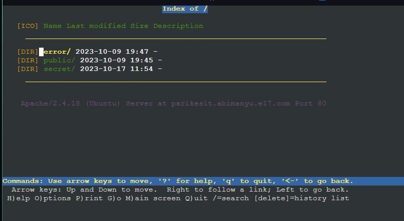

## Soal 14
> Pada subdomain tersebut folder /public hanya dapat melakukan directory listing sedangkan pada folder /secret tidak dapat diakses (403 Forbidden).

### Script Pengerjaan
- Buka file /etc/apache2/sites-available/parikesit.abimanyu.E17.conf
- Tambahkan konfigurasi di dalam tag VirtualHost untuk membuat directory /var/www/abimanyu.E17/public dapat melakukan directory listing dengan memberikan "Options +Indexes" dan buat directory /var/www/abimanyu.E17/secret tidak dapat diakses dengan memberikan "Options -Indexes"
```
<Directory /var/www/parikesit.abimanyu.E17/public>
          Options +Indexes
  </Directory>

  <Directory /var/www/parikesit.abimanyu.E17/secret>
          Options -Indexes
  </Directory>
```
- Setelah itu, untuk membuktikan nya cukup dengan memasukkan command berikut pada Node Client
```
lynx parikesit.abimanyu.E17.com/public
lynx parikesit.abimanyu.E17.com/secret
```
### Hasil
- parikesit.abimanyu.E17.com/public
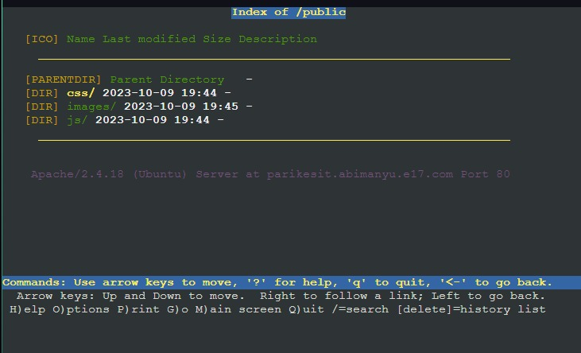
- parikesit.abimanyu.E17.com/secret


## Soal 15
> Buatlah kustomisasi halaman error pada folder /error untuk mengganti error kode pada Apache. Error kode yang perlu diganti adalah 404 Not Found dan 403 Forbidden.

### Script Pengerjaan
- Buka file /etc/apache2/sites-available/parikesit.abimanyu.E17.conf
- Tambahkan konfigurasi di dalam tag VirtualHost untuk membuat halaman error dengan kode 404 agar diarahkan ke /error/404.html dan kode 403 diarahkan ke `/error/403.html
```
ErrorDocument 404 /error/404.html
ErrorDocument 403 /error/403.html
```
- Setelah itu, untuk membuktikan custom error cukup dengan menjalankan command berikut pada Node Client
```
lynx parikesit.abimanyu.E17.com/testerror
lynx parikesit.abimanyu.E17.com/secret
```
### Hasil
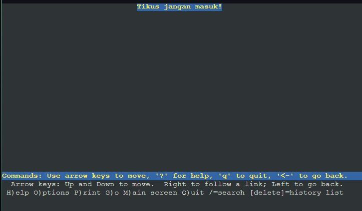
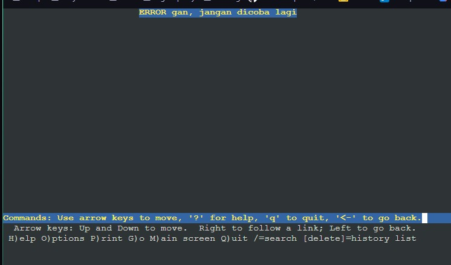

## Soal 16
> Buatlah kustomisasi halaman error pada folder /error untuk mengganti error kode pada Apache. Error kode yang perlu diganti adalah 404 Not Found dan 403 Forbidden.

### Script Pengerjaan
- Buka file /etc/apache2/sites-available/parikesit.abimanyu.E17.conf
- Tambahkan konfigurasi di dalam tag VirtualHost untuk membuat alias terhadap /var/www/parikesit.abimanyu.E17/public/js menjadi /js
```
Alias "/js" "/var/www/parikesit.abimanyu.E17/public/js"
```
- Lakukan pengujian pada client node Nakula, dengan perintah
```
lynx parikesit.abimanyu.E17.com/js
```
### Hasil
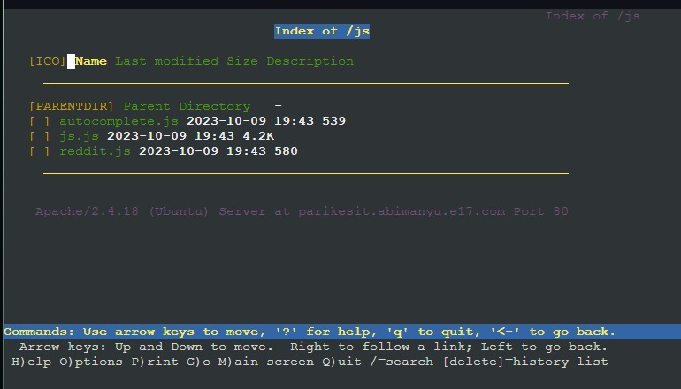

## Soal 17
> Agar aman, buatlah konfigurasi agar www.rjp.baratayuda.abimanyu.yyy.com hanya dapat diakses melalui port 14000 dan 14400.

### Script Pengerjaan
- Buka file /etc/apache2/ports.conf dan tambahkan 2 baris konfigurasi untuk melakukan Listen terhadap port 14000 dan 14400
```
Listen 14000
Listen 14400
```
- Import file dari google drive yang disediakan untuk mengisi /var/www dari rjp.baratayuda.abimanyu.E17.com
```
wget --no-check-certificate 'https://docs.google.com/uc?export=download&id=1pPSP7yIR05JhSFG67RVzgkb-VcW9vQO6' -O rjp
```
- Lakukan unzip dan sesuaikan struktur folder untuk tepat berada di dalam /var/www/rjp.baratayuda.abimanyu.E17/abimanyu.E17
```
unzip rjp -d rjp.baratayuda.abimanyu.E17
rm rjp
mv rjp.baratayuda.abimanyu.E17/rjp.baratayuda.abimanyu.yyy.com/* rjp.baratayuda.abimanyu.E17
rmdir rjp.baratayuda.abimanyu.E17/rjp.baratayuda.abimanyu.yyy.com
```
- Buat file rjp.baratayuda.abimanyu.E17.conf pada /etc/apache2/sites-available
```
nano rjp.baratayuda.abimanyu.E17.conf
```
- Isi file tersebut dengan konfigurasi untuk port 14000 dan 14400 dengan masing-masing tag VirtualHost memiliki properti nama server, alias server, admin server, dan DocumentRoot yang diarahken pada /var/www/rjp.baratayuda.abimanyu.E17
```
<VirtualHost *:14000 *:14400>
  ServerAdmin webmaster@localhost
  DocumentRoot /var/www/rjp.baratayuda.abimanyu.E17
  ServerName rjp.baratayuda.abimanyu.E17.com
  ServerAlias www.rjp.baratayuda.abimanyu.E17.com

  ErrorDocument 404 /error/404.html
  ErrorDocument 403 /error/403.html

  ErrorLog ${APACHE_LOG_DIR}/error.log
  CustomLog ${APACHE_LOG_DIR}/access.log combined
</VirtualHost>
```
- Setelah itu, kita perlu melakukan aktivasi dan restart server Apache2
```
a2ensite rjp.baratayuda.abimanyu.E17.com.conf
service apache2 restart
```
- Untuk pengujian dengan mengakses port 14000 atau 14400
```
lynx rjp.baratayuda.abimanyu.E17.com:14000
lynx rjp.baratayuda.abimanyu.E17.com:14400
```
### Hasil
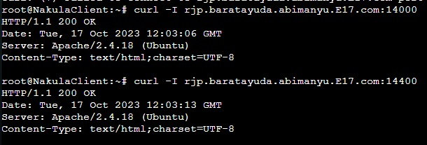


## Soal 18
> Untuk mengaksesnya buatlah autentikasi username berupa “Wayang” dan password “baratayudayyy” dengan yyy merupakan kode kelompok. Letakkan DocumentRoot pada /var/www/rjp.baratayuda.abimanyu.yyy.

### Script Pengerjaan
- Karena www.rjp.baratayuda.abimanyu.E17.com membutuhkan Authentication, daftarkan username dan password yang sudah ditentukan beserta *error message* nya. "Wayang" untuk username dan "baratayudaE17" untuk passwordnya
	```
	echo -e '<VirtualHost *: 14000 *: 14400>
		ServerAdmin webmaster@localhost
		DocumentRoot /var/www/rjp.baratayuda. abimanyu. E17
		ServerName rjp.baratayuda. abimanyu. E17. com
		ServerAlias www.rjp.baratayuda.abimanyu. E17. com

		<Directory /var/www/rjp.baratayuda. abimanyu. E17>
				AuthType Basic
				AuthName "Restricted Content"
				AuthUserFile /etc/apache2/.htpasswd
				Require valid-user
		</Directory>

		ErrorDocument 404 /error/404.html
		ErrorDocument 403 /error/403.html
		ErrorLog $ {APACHE_LOG_DIR}/error. log
		CustomLog $ {APACHE_LOG_DIR}/access. log combined
	</VirtualHost>' > /etc/apache2/sites-available/rjp.baratayuda. abimanyu. E17. com. conf

	htpasswd -c -b /etc/apache2/.htpasswd Wayang baratayudaE17
	```

- Jangan lupa di-*enabled* dan apache di *restart*
	```
	a2ensite rjp.baratayuda.abimanyu.E17.com.conf
	service apache2 restart
	```
### Hasil
Berikut perbandingan yang tidak menggunakan dan menggunakan Authentication </br>
- Tidak menggunakan Authentication
	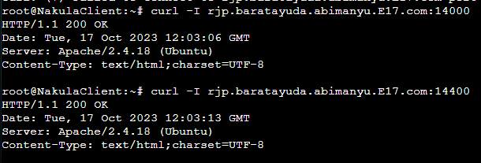

- Menggunakan Authentication
	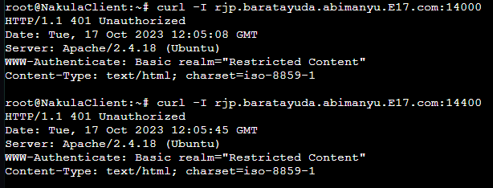

## Soal 19
> Buatlah agar setiap kali mengakses IP dari Abimanyu akan secara otomatis dialihkan ke www.abimanyu.yyy.com (alias)

### Script Pengerjaan
- Untuk mengalihkan akses dari IP Abimanyu ke www.abimanyu.E17.com, diperlukan penambahan command ```Redirect``` dalam file ```/etc/apache2/sites-available/000-default.conf```
	```
	echo -e '<VirtualHost *: 80>
		ServerAdmin webmaster@abimanyu.E17.com
		DocumentRoot /var/www/html

		ErrorLog $ {APACHE_LOG_DIR}/error.log
		CustomLog $ {APACHE_LOG_DIR}/access. log combined
		
		Redirect / http://www.abimanyu.E17.com/

	</VirtualHost>' > /etc/apache2/sites-available/000-default.conf
	```

### Hasil
- Bukti IP Abimanyu, yakni 10.45.3.4 akan dialihkan ke www.abimanyu.E17.com
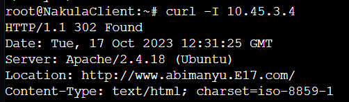

- Tampilan www.abimanyu.E17.com
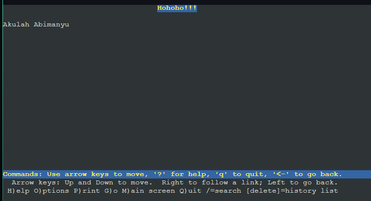

## Soal 20
> Karena website www.parikesit.abimanyu.yyy.com semakin banyak pengunjung dan banyak gambar gambar random, maka ubahlah request gambar yang memiliki substring “abimanyu” akan diarahkan menuju abimanyu.png.

### Script Pengerjaan
- Aktikan modul rewrite terlebih dahulu. Kemudian tambahkan konfigurasi untuk melakukan redirect saat mengakses gambar yang memiliki kata "abimanyu" di namanya menuju ```abimanyu.png```
	```
	a2enmod rewrite
	
	echo '
	RewriteEngine On
	RewriteCond %{REQUEST_URI} ^/public/images/ ( .* ) (abimanyu) ( .* \. (png |jpg) )
	RewriteCond %{REQUEST_URI} !/public/images/abimanyu.png
	RewriteRule abimanyu http: //parikesit. abimanyu. E17. com/public/images/abimanyu.png$1 [L, R=301]
	' > /var/www/parikesit.abimanyu.E17/.htaccess
	```

- Mengatur konfigurasi situs yang ada di ```/etc/apache2/sites-available/parikesit.abimanyu.E17.com.conf```
	```
	echo "
	<VirtualHost *: 80>

		ServerAdmin webmaster@localhost
		DocumentRoot /var/www/parikesit.abimanyu. E17
		ServerName parikesit.abimanyu.E17. com
		ServerAlias www.parikesit.abimanyu.E17.com

		Directory /var/www/parikesit.abimanyu. E17/public>
				Options +Indexes
		</Directory>

		<Directory /var/www/parikesit.abimanyu.E17/secret
				Options -Indexes
		</Directory>

		<Directory /var/www/parikesit.abimanyu. E17>
				Options +FollowSymLinks -Multiviews
				AllowOverride All
		</Directory>

		ErrorLog ${APACHE_LOG_DIR}/error.log
		CustomLog ${APACHE_LOG_DIR}/access.log combined

		ErrorDocument 404 /error/404.html
		ErrorDocument 403 /error/403.html

		Alias /js /var/www/parikesit.abimanyu.E17/public/js

	</VirtualHost>
	" > /etc/apache2/sites-available/parikesit.abimanyu.E17.com.conf
	```

- Jangan lupa untuk merestart apache
	```
	service apache2 restart
	```
### Hasil
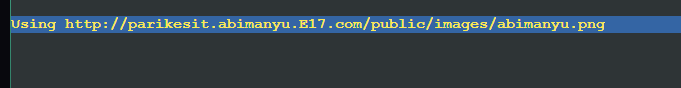

